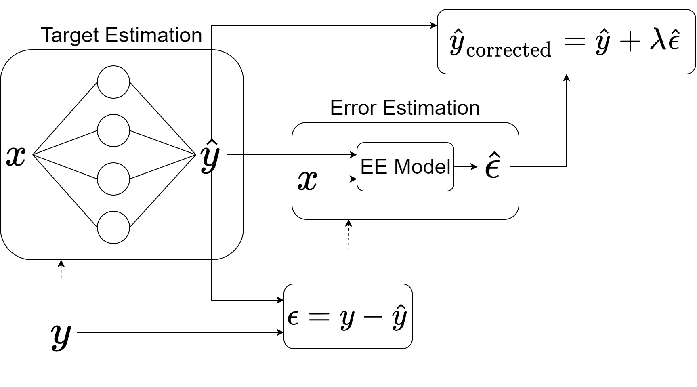

# A Novel Method to Estimate Measurement Error in AI-Assisted Measurements
- [paper](https://www.researchgate.net/publication/360833127_A_Novel_Method_to_Estimate_Measurement_Error_in_AI-Assisted_Measurements)
- A framework to estimate the error of machine learning models on a sample level.


# Requirements

```bash
keras==2.7.0
matplotlib==3.5.1
numpy==1.22.1
pandas==1.4.0
scipy==1.7.3
sklearn==1.0.2
tensorflow==2.7.0
```
